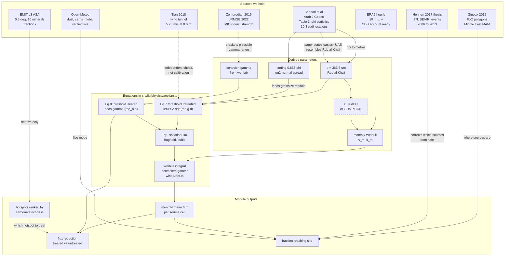

# Dust Exposure Toolkit, knowledge graph

How every dataset and paper we hold connects to a number the model actually uses, and
where the connections are weak.

Companion to `DUST_EXPOSURE_DATA_SOURCES.md` (what the data is) and
`DUST_EXPOSURE_BUILD_PLAN.md` (how to build it). This file is the reasoning layer between
them.

Every value here was read from a file in `references/` or computed from those values by a
named equation. `scripts/link_uae_parameters.py` regenerates all of it and writes
`public/data/uae_parameters.json`. Nothing below is estimated.

---

## 1. The graph



Solid arrows are quantitative links. Dashed arrows are qualitative or checking links that
must not be used to produce a number.

---

## 2. The chains, in order

### Chain A, grain size to erosion threshold

This is the backbone. It runs from a measured table to a number the UI shows.

| Step | Value | Where it comes from |
| --- | --- | --- |
| 1. Read the table | Rub al Khali, mean 1.460 phi, sorting 0.863 phi, n = 12 | Benaafi et al., Table 1, `references/sedimentological_saudiarabia.md`, DOI `10.1007/s12517-015-1970-9` |
| 2. Convert units | d = 2^-1.460 mm = **363.5 um** | Krumbein definition, d[mm] = 2^-phi |
| 3. Apply Eq 7 | u*t0 = **0.3054 m/s** | `aeolian.ts` `thresholdUntreated`, A = 0.11 |
| 4. Propagate A's range | 0.2221 to 0.3887 m/s for A in [0.08, 0.14] | `AEOLIAN_CALIB.A` stated range |

**The transfer to the UAE is the paper's own claim, not ours.** Benaafi et al. state in the
Discussion that the fine-grained dune sands of the eastern UAE, citing Al-Sayed 1999, are
similar to dune sands of the Rub al Khali and Sakaka. That sentence is the entire
justification for using Saudi measurements at an Emirati site, so cite it explicitly and
show both analogues rather than one:

| UAE analogue | mean phi | d | u*t0 |
| --- | --- | --- | --- |
| Rub al Khali (n = 12) | 1.460 | 363.5 um | 0.3054 m/s |
| Sakaka (n = 12) | 2.290 | 204.5 um | 0.2290 m/s |
| Eastern Province (n = 9) | 1.999 | 250.2 um | 0.2534 m/s |

Present the spread across analogues as the honest uncertainty on grain size, because it is
larger than any formal error bar you could put on a single one.

**This closes gap 5.4.** The data doc said no public grain size distribution existed per
erg. Sorting in phi is the standard deviation of a log2-normal distribution, so
Table 1 gives mean and spread together. For the Rub al Khali the 16th to 84th percentile
range is 199.9 to 661.1 um. That is the distribution the `grainsize` module needed.

### Chain B, the independent check

Tian et al. 2018 measured the threshold wind velocity of untreated aeolian sandy soil at
**5.73 m/s with the anemometer at 0.6 m** (`references/land_degrad_dev_2018.md`, DOI
`10.1002/ldr.3176`).

Converting our u*t0 to a 0.6 m wind speed needs the log law and a roughness length. Using
Bagnold's z0 = d/30:

| Location | z0 | predicted U(0.6 m) | ratio to Tian |
| --- | --- | --- | --- |
| Rub al Khali | 12.1 um | 8.25 m/s | 1.44x |
| Sakaka | 6.8 um | 6.52 m/s | 1.14x |

Inverting instead, Tian's 5.73 m/s implies d = 149.6 um, or 2.74 phi, under the same
assumptions.

**Read this correctly.** Tian's soil is a Chinese aeolian sandy soil, not Arabian dune
sand, and a finer grain size is exactly what you would expect. The chain predicts the
right magnitude and the right direction of difference. That is a consistency check and it
belongs in the write-up as one. It is **not** a calibration, and it must never be used to
tune A or z0, because a check you have tuned against is no longer a check.

### Chain C, wind to flux

```
ERA5 hourly 10 m u,v
   -> fit Weibull (A_m, k_m) per cell per month        scripts/fit_era5_weibull.py
   -> u* = uStarRatio * U10                            AEOLIAN_CALIB.uStarRatio = 0.03
   -> integrate Eq 9 over the Weibull                  windStats.ts, closed form
   -> <q> monthly mean flux
```

The integral is exact and already verified, see `scripts/verify_weibull_flux.py` and §5.2
of the build plan.

**A finding worth recording.** `AEOLIAN_CALIB.uStarRatio = 0.03` was documented as a
generic log-law ratio with no reference height. Solving `kappa / ln(z/z0) = 0.03` with the
Rub al Khali roughness gives z = 7.5 m, and evaluating the log law at 10 m gives 0.0294.

| z | u*/U, Rub al Khali | u*/U, Sakaka |
| --- | --- | --- |
| 0.6 m | 0.0370 | 0.0351 |
| 2 m | 0.0333 | 0.0318 |
| **10 m** | **0.0294** | **0.0282** |
| 50 m | 0.0263 | 0.0253 |

So the existing constant corresponds to a roughly 10 m reference height, which is exactly
the height of both the ERA5 wind and the Open-Meteo wind. The constant and the new data
sources agree without anyone having planned it. Record the reference height next to the
constant in `constants.ts`, because the value is meaningless without it, and a future
change to a 2 m or 50 m wind source would silently break it.

### Chain D, where the dust comes from

Two sources disagree, and the disagreement is the interesting part.

- **Ginoux 2012** gives FoO contour polygons on a 0.1 degree grid. Dense over the Gulf,
  3,007 polygons over the Arabian Peninsula box. **MAM only** for the Middle East.
- **Hennen 2017** logged 27,000 individual emission events from SEVIRI at 15 minute
  resolution for 2006 to 2013 and reports the Tigris and Euphrates flood plain as the most
  active region at 37% of all events, with very few emissions over the southern Arabian
  Peninsula.

Ginoux measures where dust **is**, from optical depth. Hennen measures where dust **starts**,
from plume onset. For a product that treats the ground at a source, the second is the
right quantity, and the thesis makes that criticism explicitly.

**The consequence for the UAE.** If the dominant regional source is a flood plain about a
thousand kilometres to the northwest rather than the sand sea next door, then the model is
a long-range Shamal transport problem. Wind direction becomes the central input, and GWA 4
does not carry direction at all, so ERA5 is not optional. Settle the transport backbone
(build plan §6) with this in mind.

### Chain E, the product effect

```
wet lab measures cohesion gamma
   -> Eq 8 raises u*t                 aeolian.ts thresholdTreated
   -> raises ut = u*t / r
   -> raises x = (ut/A_m)^k           the incomplete gamma lower limit
   -> <q> falls
```

The whole product story is one parameter moving through one integral. That is worth saying
plainly in the UI, because it is the cleanest part of the model.

The MICP papers bracket what gamma could plausibly be, they do not supply it:

| Paper | What it measured | Use |
| --- | --- | --- |
| Tian 2018, `10.1002/ldr.3176` | Untreated threshold 5.73 m/s at 0.6 m; UCS and permeability of cemented soil | Untreated anchor, chain B |
| Zomorodian 2019, `10.1016/j.aeolia.2019.06.001` | Torvane crustal shear strength vs curing, silica **and carbonate** sands, MICP spray | Closest analogue to a sprayed field product |
| JRMGE 2022, `10.1016/j.jrmge.2021.12.008` | Wind tunnel at 10, 20, 30 m/s on **calcareous desert sand**; erosion 0.02% at 30 m/s for the best treatment; calcite content by calcimeter | Closest analogue to Gulf substrate |

The headline efficiency number stays yours, measured, and labelled as such. These three
tell a judge that your number is in a plausible range. They cannot replace it.

### Chain F, mineralogy, and where it stops

EMIT L3 ASA over the UAE box, measured today from the file:

| Window | coverage | Calcite mean | Dolomite mean | sum of ten | calcite share of retrieved |
| --- | --- | --- | --- | --- | --- |
| UAE + N Oman | 44% | 0.1201 | 0.0167 | 0.2584 | 0.465 |
| Rub al Khali | 82% | 0.0941 | 0.0097 | 0.2778 | 0.339 |
| Tigris-Euphrates | 62% | 0.0658 | 0.0076 | 0.1823 | 0.361 |

The UAE box is the most calcite-rich of the three, and by a clear margin on the share
measure. That is a real result and it supports the carbonate prong's premise that Gulf
substrate is carbonate rich.

**Then the chain stops, and it must be allowed to stop.** Three reasons, all verified
today:

1. **The ten fractions do not close.** They sum to a median of 0.21 across valid cells
   globally and never exceed 0.70. Quartz and feldspar have no diagnostic features in the
   VSWIR range EMIT measures, so they are absent by construction. EMIT does not report a
   bulk composition and cannot be read as one.
2. **The Saudi petrography disagrees numerically, and correctly so.** Benaafi et al. report
   quartz dominating coastal Arabian dune sand with a significant amount, stated as under
   10%, of calcite. EMIT reports calcite at 0.12 over the UAE box. These are not in
   conflict, they are different quantities. One is a mineral mass fraction of the whole
   sand, the other is a spectral abundance among ten retrievable minerals.
3. **The uncertainty layer is not what it looks like.** `Calcite_Uncertainty` maxes at
   2.2e-4 against abundances up to 0.59. That is the standard error of aggregating many
   60 m pixels into a 0.5 degree cell, not the uncertainty of the mineral retrieval.
   Plotting it as an error bar would claim four significant figures of confidence in a
   spectral identification. Do not do it.

**So the defensible use of EMIT is ordinal, not cardinal.** Rank hotspots by carbonate
richness to decide where the product is best matched to the substrate. Do not print a
carbonate percentage. If a carbonate percentage is needed, it has to come from the
calcimeter measurements in the MICP literature or from your own samples.

---

## 3. Weak links, listed so nobody trips over them

| # | Link | Problem | What to do |
| --- | --- | --- | --- |
| 1 | z0 = d/30 | An assumption, used in **both** chain B and chain C. A single wrong value moves the validation and the production model in the same direction, which would make a broken model look validated. | State it once, in one constant. Add a sensitivity slider. Never tune it against Tian. |
| 2 | Saudi to UAE grain size transfer | Rests on one sentence in one paper | Cite the sentence. Show all three analogues. Treat the spread as the uncertainty. |
| 3 | EMIT to bulk carbonate | Broken, see chain F | Ordinal use only |
| 4 | EMIT uncertainty layer | Means aggregation SE, not retrieval error | Do not display as an error bar |
| 5 | Ginoux MAM only | No other season exists for the Middle East | Fixed source mask, seasonality from the wind side. Read Chappell 2023 for a possible replacement. |
| 6 | FoO to emitted mass | Frequency of activation is not mass | Never convert without labelling it |
| 7 | `uStarRatio` reference height | Undocumented in `constants.ts` | Record 10 m next to the value |
| 8 | Benaafi Table 1 skewness | OCR dropped three values | Read from the PDF before using skewness |
| 9 | EMIT coverage over the UAE | 44%, patchy at 0.5 degrees | Per hotspot, not a continuous raster |
| 10 | EMIT file metadata | Internal title says 0.1 deg, the grid is 0.5 deg | Trust the coordinate arrays, not the title string |

---

## 4. Does this reach the goal

The goal is to estimate how much wind-blown dust reaches a site, where it came from, and
how much the product reduces it.

| Piece | Status |
| --- | --- |
| Grain size and its distribution for a UAE-relevant substrate | **Have it.** Chain A. Was gap 5.4. |
| Untreated erosion threshold | **Have it.** 0.3054 m/s for Rub al Khali, with a stated range. |
| An independent sanity check on that threshold | **Have it.** Chain B. |
| Wind statistics that respect the cubic law | **Method settled and verified.** Needs the ERA5 pull. |
| Where the sources are | **Have it,** with the MAM caveat and the Hennen correction. |
| Substrate carbonate, for prong matching | **Have it, ordinally.** Chain F. |
| Product effect | **Bracketed, not measured.** Waits on the wet lab, as it should. |
| **Fraction reaching the site** | **Not yet.** Blocked on the transport decision. |

Seven of eight. The one gap is the transport backbone, and it is a decision rather than
missing data.

---

## 4a. Marticorena Eq 43, found

The coefficients the OCR lost are quoted in Chappell et al. 2024 GRL Eq 3
(`references/2023GL106540.pdf`): `F/Q = 10^(0.134*clay% - 6.0)` for 0 to 20% clay.
Verified self-consistent at 479x across the range against the paper's own "nearly 3
orders of magnitude", and dimensionally correct. Implemented in
`scripts/transport_model.py`. Closes weak link 2 of the old section 6.

## 4b. Transport, now decided

The gap in section 4 is closed. See `DUST_EXPOSURE_TRANSPORT_AND_VALUE.md`. In short:
essentially all UAE dune sand mass saltates, and saltating mass lands within tens of
metres, so this is a near-field settling problem and not a dispersion problem. Suspension
comes from CAMS as a background. The consequence for the UI is a three-orders-of-magnitude
scale mismatch between the hotspot layer and the transport length, which that document
sets out.

## 5. Next actions

1. **Decide the transport backbone.** Build plan §6. Read Chappell 2023 and the Hennen
   seasonality chapters first, both in `references/`. The Tigris-Euphrates finding points
   toward trajectories rather than a local scheme.
2. **Pull ERA5.** The CDS key is in place. `scripts/fit_era5_weibull.py` is the next script
   and chain C is otherwise ready.
3. **Record the reference height** next to `uStarRatio` in `constants.ts`, weak link 7.
4. **Read Benaafi Table 1 skewness from the PDF**, weak link 8.
5. **Convert the Ginoux KML** to simplified GeoJSON, build plan phase 1.
